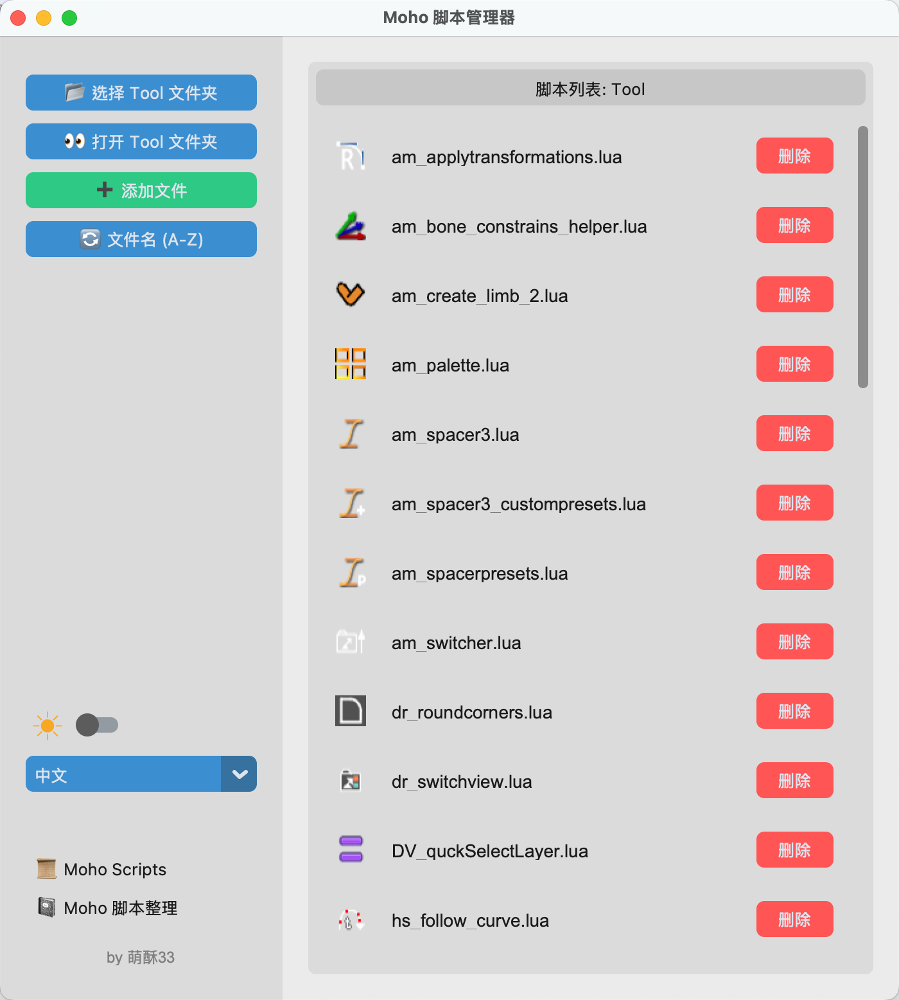

**Moho Script Manager** 是一款用于快速管理 Moho 脚本的工具。

---

## ✨ 功能：
- **📂 脚本管理**
    - 自动识别并列出 `Tool` 文件夹下的 Lua 脚本。
    - **图标同步**：自动显示脚本同名的 `.png` 图标，添加/删除脚本时自动处理图标文件。

- **💠 关联检查**
    - **智能添加**：添加脚本时，自动检测代码中是否包含 `ScriptResources` 或 `utility` 引用，并引导用户添加关联文件。
    - **安全删除**：删除脚本时，自动检测是否有关联资源文件，并弹窗询问是否一并删除或保留，防止误删或残留。

- **⇅ 灵活排序**
    - 支持三种排序模式循环切换：`文件名 (A-Z)`、`文件名 (Z-A)`、`修改时间 (最新)`。

- **🎨 可视化界面**
    - 基于 CustomTkinter 构建，美观简洁。
    - **日夜模式**：支持一键切换 深色/浅色 主题 (☀ / ☪)。
    - **多语言支持**：内置 中文、English、Русский、日本語、한국어、Español 六种语言。

- **🚀 便捷操作**
    - 自动记忆上次打开的文件夹路径。
    - 一键在 资源管理器/Finder 中打开当前目录。

---

## 🛠️ 安装与运行：

确保你的电脑已安装 [Python](https://www.python.org/downloads/)。

1. 下载  [MohoScriptManager.py](https://github.com/hailey07/Moho-Scripts-Manager/blob/main/MohoScriptsManager.py)  or [Moho Scripts Manager V1.zip](https://github.com/hailey07/Moho-Scripts-Manager/releases/download/2026-01-08/Moho.Scripts.Manager.V1.zip) 到本地。

2. 安装依赖库

    打开终端（Terminal）或命令提示符（CMD），运行以下命令：
    ```
    pip install customtkinter Pillow
    ```

3. 运行工具

   - 方法 1：解压 ``Moho Scripts Manager V1.zip`` 文件，双击运行 ``Moho Scripts Manager V1``
   
   - 方法 2：打开 Terminal 或 CMD，进入 ``MohoScriptsManager.py`` 文件所在的文件夹
   
    ```
    python MohoScriptsManager.py

    或

    python3 MohoScriptsManager.py
    ```

---

## 📖 使用方法：
1. **初次启动**：
    - 打开软件，点击左上角的 **``📂 选择 Tool 文件夹``**。
    - 定位到你的 Moho 自定义文件夹下的 `scripts/tool` 文件夹。

2. **添加脚本**：
    - 点击 **``＋ 添加文件``**，选择下载好的 `.lua` 文件。
    - 如果同目录下有同名 `.png`，工具会自动一起复制。
    - 如果脚本需要关联资源，工具会弹窗提示。

3. **删除脚本**：
    - 在列表中点击红色的 **"删除"** 按钮。
    - 如果脚本安全，会直接删除；如果脚本包含复杂依赖，会弹出确认框。

---

## 🖼︎ 截图



## 💗 感谢
此工具使用 Gemini 编写

如果你觉得这个工具有用，欢迎分享给更多 Moho 动画创作者！
