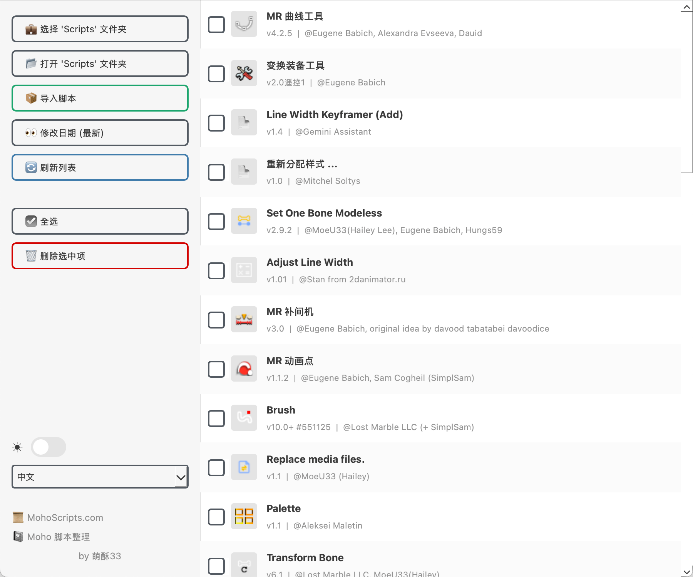
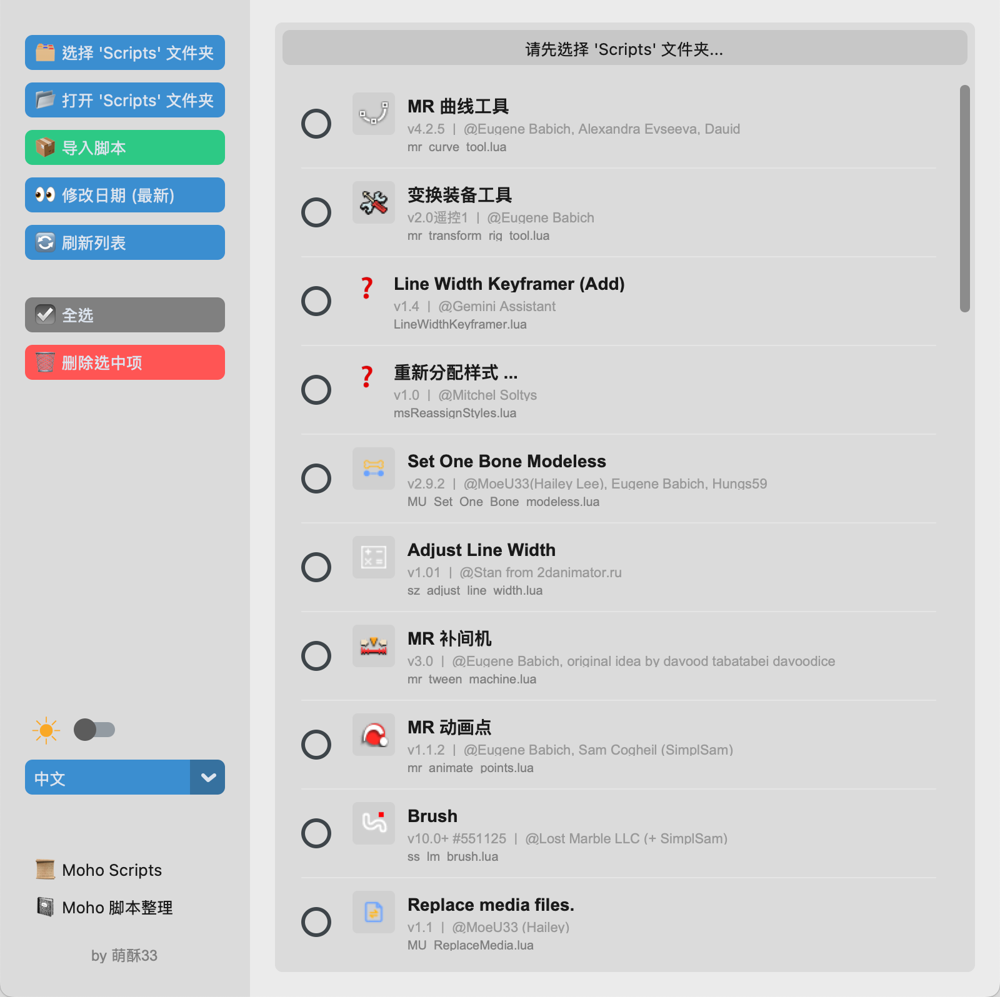

# Moho Scripts Manager

[English](#english) | [中文说明](#chinese)

   
  
    
  
  
  

---

## 🇬🇧 English Description

**Moho Scripts Manager** is a tool for quickly managing Moho scripts.

### 📥 Download & Install

You can choose to download the standalone app (recommended) or run the Python source code.

#### Option 1: Download App
No Python installation required. Just download and run.

1.  Go to the [**Releases Page**](https://github.com/hailey07/Moho-Scripts-Manager/releases).
2.  Download the file for your OS:
    * **Windows**: `MohoScriptsManager-win.exe`
    * **macOS**: `MohoScriptsManager-mac.zip` (Extract to get the App)

> **⚠️ Note for macOS Users:** > If you see a warning saying the app "cannot be opened because the developer cannot be verified":
> 1. **Right-click** (or Control-click) the App.
> 2. Select **Open**.
> 3. Click **Open** in the dialog box.

---

#### Option 2: Run from Source Code
1.  **Download `MohoScriptsManager-win.py` or `MohoScriptsManager-mac.py` , and `lang_config.py` **
2.  **Install Python 3.8+**
3.  **Install Dependencies**:
    * Windows: `pip install PyQt6`
    * macOS: `pip install customtkinter pillow`
4.  **Run**:
    * Windows: `python MohoScriptsManager-win.py`
    * macOS: `python MohoScriptsManager-mac.py`

---

### ✨ Key Features
* **Smart Deletion**: Automatically scans and deletes associated files in `ScriptResources`, `Utility`, and embedded layouts when you delete a script.
* **Easy Import**: Batch import scripts from folders. Automatically merges `Tool`, `ScriptResources`, `Menu` etc.
* **Flexible Sorting**: Supports three sorting modes that cycle through: `filename (A-Z)`， `filename (Z-A)`，和 `modified time (latest)`
* **Visual Interface**: 
  * Native PyQt6 UI for **Windows** and Modern CustomTkinter UI for **macOS**.
  * **Day/Night Mode**: Supports one-click switching between dark and light themes (☀ / ☪).

---

## 🇨🇳 中文说明

**Moho 脚本管理器** 是一款用于快速管理 Moho 脚本的工具。

### 📥 下载与安装

你可以直接下载打包好的程序（无需配置环境），也可以下载源码运行。

#### 方法一：直接下载程序
适合普通用户，不需要安装 Python。

1.  前往项目的 [**Releases (发布页)**](https://github.com/hailey07/Moho-Scripts-Manager/releases) 下载最新版。
2.  根据你的系统选择：
    * **Windows**: 下载 `MohoScriptsManager-win.exe`，双击即可运行。
    * **macOS**: 下载 `MohoScriptsManager-mac.zip`，解压后得到应用程序。

> **⚠️ macOS 用户请注意：**
> 如果双击打开时提示“无法打开，因为无法验证开发者”：
> 1. 请对着图标点击 **鼠标右键**。
> 2. 选择 **“打开” (Open)**。
> 3. 在弹出的窗口中再次点击 **“打开”** 即可。

---

#### 方法二：运行源代码
1.  **下载 `MohoScriptsManager-win.py` 或 `MohoScriptsManager-mac.py`，及`lang_config.py` 文件。**
2.  **安装 Python 3.8 或更高版本**
3.  **安装依赖库**：
    * Windows: `pip install PyQt6`
    * macOS: `pip install customtkinter pillow`
4.  **运行脚本**：
    * Windows: `python MohoScriptsManager-win.py`
    * macOS: `python MohoScriptsManager-mac.py`

---

### ✨ 主要功能
* **智能删除**：删除脚本时，自动扫描并同步删除 `ScriptResources`、`Utility` 中的关联文件，拒绝残留。

* **一键导入**：支持批量导入脚本文件夹。自动归档 `Tool`、`ScriptResources` 等子文件夹。

* **排序查看**：支持三种排序模式循环切换：`文件名 (A-Z)`、`文件名 (Z-A)`、`修改时间 (最新)`。

* **可视化界面**：

  * **Windows** 使用 PyQt6 高性能界面，**Mac** 使用 CustomTkinter 现代化界面。
  * **日夜模式**：支持一键切换 深色/浅色 主题 (☀ / ☪)。
  * **多语言支持**：内置 中文（简/繁）、英语、俄语、西班牙语等。

  
---

## 🖼︎ Screenshot

**Windows**

**macOS**

---

## 👤 Author
**MoeU33**

## 💗 Thanks

This tool was written using Gemini.

If you find this tool useful, please share it with more Moho animation creators!

